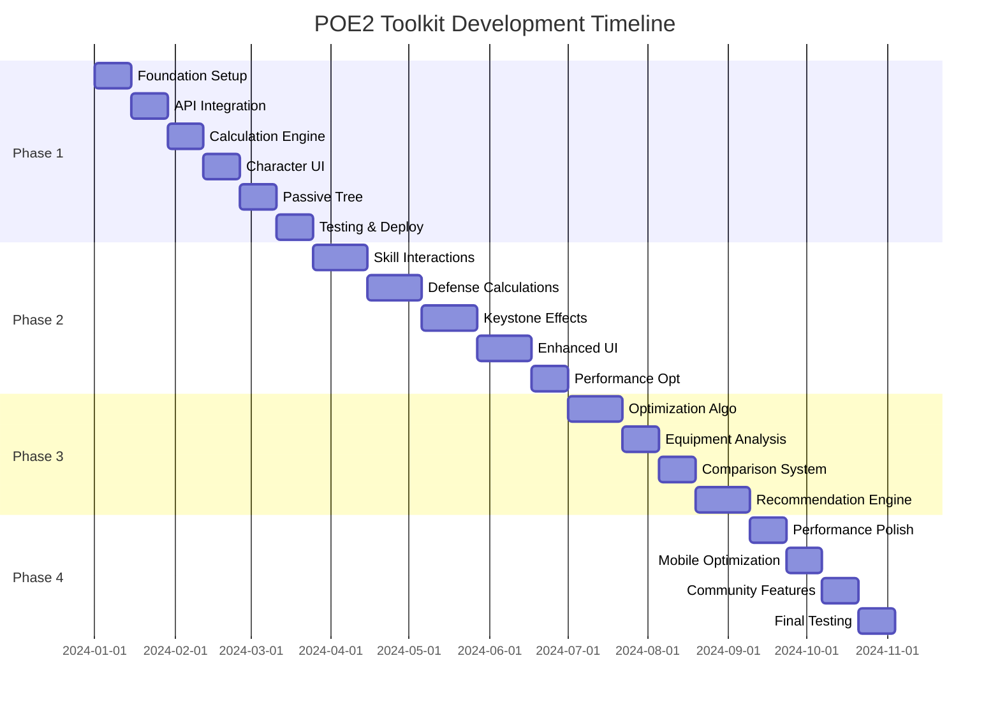

# Path of Exile 2 Toolkit - Complete Design Documentation Overview

## 📚 Documentation Structure

This document provides an overview of the complete system design and implementation plans for the Path of Exile 2 Toolkit. The project is divided into 4 phases, each with detailed High Level Design (HLD) and Low Level Design (LLD) documentation.

## Phase Documentation

### ✅ Phase 1: Foundation (MVP) - 8-12 weeks
**Status: Documentation Complete**

#### 📄 [PHASE_1_HLD.md](./PHASE_1_HLD.md)
High-level architecture covering:
- System architecture with Next.js, TypeScript, and React
- OAuth 2.0 PKCE authentication flow
- API integration with rate limiting
- Core calculation engine architecture
- Passive tree system design
- Caching and performance strategies
- Security architecture
- Database schema (IndexedDB)

#### 📄 [PHASE_1_LLD.md](./PHASE_1_LLD.md)
Detailed implementation including:
- Week-by-week implementation timeline
- Complete code examples for all modules
- Authentication service implementation
- API client with rate limiting
- Damage calculator implementation
- Web Worker setup for calculations
- Character management components
- Passive tree visualization
- Testing setup and deployment configuration

### ✅ Phase 2: Advanced Mechanics - 10-14 weeks
**Status: Documentation Complete**

#### 📄 [PHASE_2_HLD.md](./PHASE_2_HLD.md)
Advanced features architecture:
- Skill interaction and combo system
- Support gem calculations
- Advanced defensive mechanics (EHP, mitigation layers)
- Damage over time (DoT) system
- Keystone passive effects
- Enhanced UI components
- Performance optimization strategies

#### 📄 PHASE_2_LLD.md (To be created)
Will include:
- Skill combo detection implementation
- Support gem optimizer algorithm
- EHP calculation formulas
- DoT stacking mechanics
- Keystone effect implementations
- Advanced UI component code

### 🔄 Phase 3: Optimization Features - 8-10 weeks
**Status: Documentation Pending**

#### Key Features to Design:
- **Genetic Algorithm Build Optimizer**
  - Population-based optimization
  - Multi-objective fitness functions
  - Crossover and mutation strategies

- **Equipment Optimization Engine**
  - Upgrade recommendation system
  - Market price integration
  - Efficiency scoring

- **Multi-Build Comparison**
  - Side-by-side analysis
  - Strength/weakness identification
  - Trade-off visualization

- **Incremental Improvement Suggester**
  - Next-best passive node finder
  - Gear upgrade prioritization
  - Skill gem optimization

### 🔄 Phase 4: Polish & Advanced Features - 6-8 weeks
**Status: Documentation Pending**

#### Key Features to Design:
- **Performance Enhancements**
  - Service Worker caching
  - Code splitting strategies
  - Bundle optimization
  - Lazy loading implementation

- **Mobile Optimization**
  - Responsive design system
  - Touch-friendly interfaces
  - Mobile-specific layouts
  - Performance budgets

- **Community Features**
  - Build sharing system
  - Import/export functionality
  - Build rating and comments
  - Version control for builds

- **Advanced Visualizations**
  - Interactive damage breakdown charts
  - Sankey diagrams for damage flow
  - Radar charts for build comparison
  - Heat maps for passive tree efficiency

## 🏗️ System Architecture Summary

### Technology Stack
```yaml
Frontend:
  Framework: Next.js 14 (App Router)
  Language: TypeScript 5.x
  Styling: Tailwind CSS + shadcn/ui
  State Management:
    - React Query (Server state)
    - Zustand (Client state)
    - React Hook Form (Forms)

Infrastructure:
  Hosting: Vercel Edge
  CDN: Vercel CDN
  Storage: IndexedDB (Client-side)

Performance:
  Web Workers: Calculation offloading
  Caching: Multi-layer strategy
  Optimization: Code splitting, lazy loading
```

### Core Architecture Patterns
1. **Repository Pattern** - API abstraction
2. **Strategy Pattern** - Calculation strategies
3. **Observer Pattern** - State management
4. **Factory Pattern** - Component generation
5. **Adapter Pattern** - External API integration

## 📊 Implementation Timeline



## 🎯 Key Design Principles

### 1. Performance First
- All calculations offloaded to Web Workers
- Aggressive caching at multiple levels
- Progressive enhancement for features
- Lazy loading for heavy components

### 2. Offline Capable
- IndexedDB for full offline functionality
- Service Worker for asset caching
- Conflict resolution for sync
- Background synchronization

### 3. Modular Architecture
- Clear separation of concerns
- Pluggable calculation modules
- Extensible component system
- Version-aware data structures

### 4. User Experience
- Real-time calculation feedback
- Intuitive navigation
- Mobile-responsive design
- Accessibility compliance

## 📈 Success Metrics

### Performance Targets
| Metric | Target | Critical |
|--------|--------|----------|
| First Contentful Paint | < 1.5s | < 2.5s |
| Time to Interactive | < 3s | < 5s |
| Calculation Response | < 500ms | < 1s |
| API Response (cached) | < 200ms | < 500ms |

### Quality Metrics
| Metric | Target |
|--------|--------|
| TypeScript Coverage | 100% |
| Test Coverage | > 80% |
| Lighthouse Score | > 90 |
| Bundle Size | < 500KB |

## 🚀 Next Steps

### Immediate Actions (Week 1)
1. ✅ Complete environment setup
2. ✅ Initialize project structure
3. 🔄 Implement authentication module
4. 🔄 Setup API client framework
5. 🔄 Create basic UI components

### Short Term (Weeks 2-4)
1. Complete OAuth integration
2. Implement rate limiting
3. Build calculation engine core
4. Create character management UI
5. Setup testing framework

### Medium Term (Weeks 5-12)
1. Complete Phase 1 MVP
2. Deploy to staging environment
3. Begin Phase 2 implementation
4. Gather user feedback
5. Iterate on UI/UX

## 📝 Documentation Status

| Document | Status | Location |
|----------|--------|----------|
| Phase 1 HLD | ✅ Complete | [PHASE_1_HLD.md](./PHASE_1_HLD.md) |
| Phase 1 LLD | ✅ Complete | [PHASE_1_LLD.md](./PHASE_1_LLD.md) |
| Phase 2 HLD | ✅ Complete | [PHASE_2_HLD.md](./PHASE_2_HLD.md) |
| Phase 2 LLD | ✅ Complete | [PHASE_2_LLD.md](./PHASE_2_LLD.md) |
| Phase 3 HLD | ✅ Complete | [PHASE_3_HLD.md](./PHASE_3_HLD.md) |
| Phase 3 LLD | ✅ Complete | [PHASE_3_LLD.md](./PHASE_3_LLD.md) |
| Phase 4 HLD | ✅ Complete | [PHASE_4_HLD.md](./PHASE_4_HLD.md) |
| Phase 4 LLD | ✅ Complete | [PHASE_4_LLD.md](./PHASE_4_LLD.md) |

## 🔗 Related Resources

- [Path of Exile 2 API Documentation](https://www.pathofexile.com/developer/docs)
- [Next.js Documentation](https://nextjs.org/docs)
- [React Query Documentation](https://tanstack.com/query)
- [Zustand Documentation](https://github.com/pmndrs/zustand)
- [shadcn/ui Components](https://ui.shadcn.com)

## 📞 Contact & Support

For questions about the design or implementation:
- Review the detailed phase documentation
- Check the implementation examples in LLD documents
- Refer to the technical phases document
- Consult the CLAUDE.md file for development guidelines

---

*This documentation is a living document and will be updated as the project evolves.*