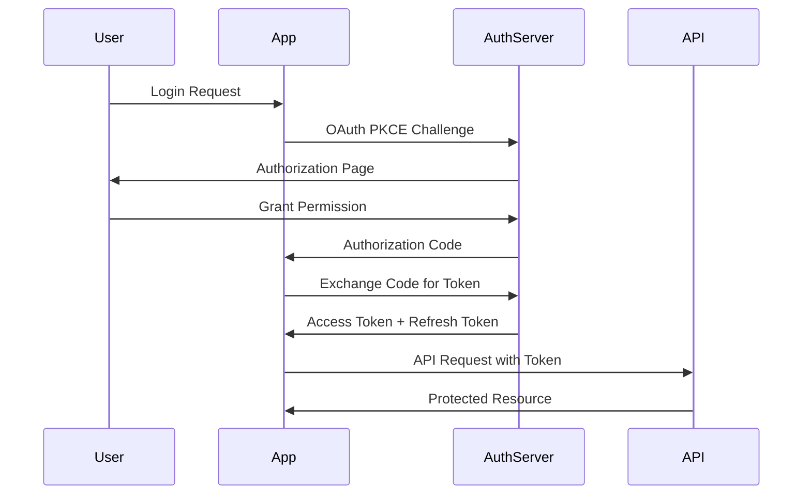

# Phase 1: Foundation (MVP) - High Level Design Document

## 1. Executive Summary

The foundation phase establishes the core architecture and essential features for the Path of Exile 2 Toolkit. This phase focuses on API integration, basic damage calculations, character data management, and passive tree visualization.

## 2. System Architecture

### 2.1 Architecture Overview
```
┌─────────────────────────────────────────────────────────────────────┐
│                           Client (Browser)                           │
├─────────────────────────────────────────────────────────────────────┤
│                                                                       │
│  ┌─────────────────┐  ┌──────────────────┐  ┌──────────────────┐  │
│  │   Next.js App    │  │  Service Worker  │  │   Web Workers    │  │
│  │    (React)       │  │    (Caching)     │  │  (Calculations)  │  │
│  └────────┬─────────┘  └──────────────────┘  └──────────────────┘  │
│           │                                                          │
│  ┌────────▼─────────────────────────────────────────────────────┐  │
│  │                     State Management Layer                    │  │
│  │  ┌──────────────┐  ┌──────────────┐  ┌──────────────────┐  │  │
│  │  │ React Query  │  │   Zustand    │  │  React Hook Form │  │  │
│  │  │  (API State) │  │ (UI State)   │  │  (Form State)    │  │  │
│  │  └──────────────┘  └──────────────┘  └──────────────────┘  │  │
│  └───────────────────────────┬──────────────────────────────────┘  │
│                              │                                       │
└──────────────────────────────┼───────────────────────────────────────┘
                               │
                    ┌──────────▼──────────┐
                    │   API Gateway        │
                    │  (Rate Limiting)     │
                    └──────────┬──────────┘
                               │
                    ┌──────────▼──────────┐
                    │  Path of Exile API  │
                    │    (External)        │
                    └─────────────────────┘
```

### 2.2 Technology Stack

#### Frontend
- **Framework**: Next.js 14 (App Router)
- **Language**: TypeScript 5.x
- **Styling**: Tailwind CSS + shadcn/ui
- **State Management**:
  - React Query (API data)
  - Zustand (Global UI state)
  - React Hook Form (Forms)

#### Infrastructure
- **Hosting**: Vercel Edge Network
- **Storage**:
  - IndexedDB (Client-side caching)
  - Local Storage (User preferences)
- **CDN**: Vercel CDN for static assets

## 3. Core Modules

### 3.1 Authentication Module
```typescript
interface AuthenticationModule {
  // OAuth 2.0 PKCE flow implementation
  authenticate(): Promise<AuthToken>
  refreshToken(): Promise<AuthToken>
  logout(): void

  // Token management
  getAccessToken(): string | null
  isAuthenticated(): boolean

  // Security features
  validateToken(): boolean
  handleTokenExpiry(): void
}
```

**Key Features:**
- OAuth 2.0 PKCE flow
- Automatic token refresh
- Secure token storage (httpOnly cookies)
- Session management

### 3.2 API Integration Layer
```typescript
interface ApiIntegrationLayer {
  // Rate limiting
  rateLimiter: RateLimiter

  // Request handling
  request<T>(endpoint: string, options?: RequestOptions): Promise<T>

  // Caching
  cacheManager: CacheManager

  // Error handling
  handleApiError(error: ApiError): void

  // Retry logic
  retryWithBackoff<T>(request: () => Promise<T>): Promise<T>
}
```

**Components:**
- Rate limiter (Token bucket algorithm)
- Request queue management
- Response caching
- Error recovery
- Circuit breaker pattern

### 3.3 Calculation Engine
```typescript
interface CalculationEngine {
  // Core calculations
  calculateDPS(character: Character): DPSResult
  calculateDefense(character: Character): DefenseResult

  // Modular calculators
  damageCalculator: DamageCalculator
  defenseCalculator: DefenseCalculator
  modifierSystem: ModifierSystem

  // Performance
  memoizedCalculations: Map<string, CalculationResult>
  workerPool: WorkerPool
}
```

**Architecture:**
- Pure functional calculations
- Immutable data structures
- Web Worker offloading
- Result memoization
- Streaming calculations

### 3.4 Character Data Management
```typescript
interface CharacterDataManager {
  // CRUD operations
  loadCharacter(id: string): Promise<Character>
  saveCharacter(character: Character): Promise<void>
  deleteCharacter(id: string): Promise<void>

  // Synchronization
  syncWithAPI(): Promise<void>
  resolveConflicts(local: Character, remote: Character): Character

  // Caching
  cacheStrategy: CacheStrategy
  invalidateCache(id: string): void
}
```

**Features:**
- Offline-first architecture
- Conflict resolution
- Optimistic updates
- Background synchronization

### 3.5 Passive Tree System
```typescript
interface PassiveTreeSystem {
  // Tree management
  loadTreeData(): Promise<PassiveTreeData>
  allocateNode(nodeId: string): AllocationResult
  deallocateNode(nodeId: string): void

  // Validation
  validatePath(path: string[]): boolean
  calculateCost(nodes: string[]): number

  // Optimization
  findOptimalPath(start: string, end: string): string[]
  suggestNodes(objective: OptimizationGoal): string[]
}
```

## 4. Data Flow Architecture

### 4.1 Request Flow
```
User Action → UI Component → Action Creator → API Service → Rate Limiter
→ HTTP Client → PoE API → Response → Cache → State Update → UI Update
```

### 4.2 Calculation Flow
```
Character Data → Validation → Worker Thread → Calculation Engine
→ Modifier Application → Result Aggregation → Memoization → UI Update
```

## 5. Security Architecture

### 5.1 Authentication Flow


### 5.2 Security Measures
- **Authentication**: OAuth 2.0 with PKCE
- **Token Storage**: HttpOnly cookies with SameSite flag
- **CSRF Protection**: Double submit cookie pattern
- **XSS Prevention**: Content Security Policy headers
- **Input Validation**: Zod schema validation
- **Rate Limiting**: Per-user and per-IP limits

## 6. Performance Optimization

### 6.1 Caching Strategy
```typescript
interface CachingLayers {
  memory: {
    ttl: 300,  // 5 minutes
    maxSize: 100 // MB
  },
  indexedDB: {
    ttl: 86400,  // 24 hours
    maxSize: 500 // MB
  },
  cdn: {
    static: 'immutable',
    dynamic: 'stale-while-revalidate'
  }
}
```

### 6.2 Optimization Techniques
- **Code Splitting**: Route-based splitting
- **Lazy Loading**: Component-level lazy loading
- **Virtual Scrolling**: For passive tree and large lists
- **Debouncing**: For calculation inputs
- **Memoization**: For expensive calculations
- **Web Workers**: For CPU-intensive operations

## 7. Database Schema

### 7.1 IndexedDB Schema
```typescript
interface DatabaseSchema {
  characters: {
    key: string  // character ID
    value: {
      id: string
      data: Character
      lastModified: number
      syncStatus: 'synced' | 'pending' | 'conflict'
    }
  },
  calculations: {
    key: string  // hash of input
    value: {
      result: CalculationResult
      timestamp: number
      version: string
    }
  },
  passiveTree: {
    key: string  // tree version
    value: {
      nodes: PassiveNode[]
      connections: Connection[]
      version: string
    }
  }
}
```

## 8. API Design

### 8.1 Internal API Structure
```typescript
interface InternalAPI {
  // Character endpoints
  '/api/characters': {
    GET: () => Character[]
    POST: (character: Character) => Character
  },
  '/api/characters/:id': {
    GET: () => Character
    PUT: (character: Character) => Character
    DELETE: () => void
  },

  // Calculation endpoints
  '/api/calculate/dps': {
    POST: (character: Character) => DPSResult
  },
  '/api/calculate/defense': {
    POST: (character: Character) => DefenseResult
  },

  // Passive tree endpoints
  '/api/passive-tree': {
    GET: () => PassiveTreeData
  },
  '/api/passive-tree/optimize': {
    POST: (params: OptimizationParams) => OptimizationResult
  }
}
```

## 9. Error Handling Strategy

### 9.1 Error Categories
```typescript
enum ErrorCategory {
  NETWORK = 'Network connectivity issues',
  AUTHENTICATION = 'Authentication/Authorization failures',
  VALIDATION = 'Input validation errors',
  CALCULATION = 'Calculation engine errors',
  RATE_LIMIT = 'API rate limit exceeded',
  SERVER = 'Server-side errors'
}
```

### 9.2 Error Recovery
- **Automatic Retry**: Exponential backoff for transient failures
- **Fallback Data**: Show cached data when API unavailable
- **Graceful Degradation**: Disable features rather than crash
- **User Notification**: Clear, actionable error messages

## 10. Testing Strategy

### 10.1 Test Coverage Goals
- **Unit Tests**: 80% coverage for calculation engine
- **Integration Tests**: API layer and state management
- **Component Tests**: Critical UI components
- **E2E Tests**: Key user journeys

### 10.2 Test Implementation
```typescript
interface TestingFramework {
  unit: 'Jest',
  component: 'React Testing Library',
  integration: 'Jest + MSW',
  e2e: 'Playwright',
  performance: 'Lighthouse CI'
}
```

## 11. Deployment Architecture

### 11.1 CI/CD Pipeline
```yaml
pipeline:
  - lint: ESLint + Prettier
  - typecheck: TypeScript compiler
  - test: Jest test suite
  - build: Next.js production build
  - deploy: Vercel deployment
  - monitor: Sentry error tracking
```

### 11.2 Environment Configuration
- **Development**: Local development with hot reload
- **Staging**: Preview deployments on PR
- **Production**: Optimized production build

## 12. Monitoring and Analytics

### 12.1 Metrics to Track
- **Performance**: Core Web Vitals (LCP, FID, CLS)
- **Errors**: Error rate, error types, affected users
- **Usage**: Active users, feature adoption, API usage
- **Business**: Character creations, calculations performed

### 12.2 Monitoring Tools
- **Error Tracking**: Sentry
- **Performance**: Vercel Analytics
- **Logging**: Structured logging with correlation IDs
- **Alerting**: Threshold-based alerts for critical issues

## 13. Scalability Considerations

### 13.1 Horizontal Scaling
- **CDN**: Static asset distribution
- **Edge Functions**: Computation at edge locations
- **Load Balancing**: Automatic via Vercel

### 13.2 Vertical Scaling
- **Web Workers**: Parallel processing
- **Streaming**: Large dataset handling
- **Pagination**: API response pagination

## 14. Success Criteria

### 14.1 Performance Metrics
- Page load time < 2 seconds
- Time to Interactive < 3 seconds
- Calculation response < 500ms
- API response time < 200ms

### 14.2 Reliability Metrics
- 99.9% uptime
- < 0.1% error rate
- Successful API sync > 95%
- Cache hit rate > 70%

## 15. Risk Assessment

### 15.1 Technical Risks
- **API Rate Limiting**: Mitigation via intelligent caching
- **Data Synchronization**: Conflict resolution strategies
- **Performance Bottlenecks**: Web Worker implementation
- **Browser Compatibility**: Progressive enhancement

### 15.2 Business Risks
- **API Changes**: Versioned API adapter layer
- **User Adoption**: MVP feature set validation
- **Competition**: Unique feature differentiation