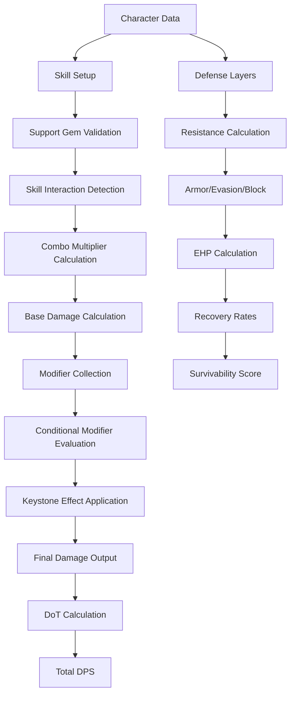

# Phase 2: Advanced Mechanics - High Level Design Document

## 1. Executive Summary

Phase 2 extends the foundation with sophisticated game mechanics including complex skill interactions, support gem calculations, advanced defensive layers, damage over time systems, and keystone passive effects. This phase transforms the toolkit from a basic calculator to a comprehensive build analysis platform.

## 2. System Architecture Extensions

### 2.1 Enhanced Architecture Overview
```
┌────────────────────────────────────────────────────────────────────────┐
│                          Advanced Calculation Layer                      │
├────────────────────────────────────────────────────────────────────────┤
│                                                                          │
│  ┌──────────────────┐  ┌──────────────────┐  ┌──────────────────────┐ │
│  │  Skill Combos    │  │  Support Gems    │  │  Damage Over Time    │ │
│  │  & Interactions  │  │   Calculator     │  │     System           │ │
│  └─────────┬────────┘  └────────┬─────────┘  └──────────┬──────────┘ │
│            │                     │                         │            │
│  ┌─────────▼─────────────────────▼─────────────────────────▼─────────┐ │
│  │                     Advanced Modifier System                       │ │
│  │  ┌──────────────┐  ┌──────────────────┐  ┌──────────────────┐   │ │
│  │  │  Conditional │  │  Multiplicative  │  │    Keystone      │   │ │
│  │  │   Modifiers  │  │     Stacking     │  │    Effects       │   │ │
│  │  └──────────────┘  └──────────────────┘  └──────────────────┘   │ │
│  └────────────────────────────────────────────────────────────────────┘ │
│                                                                          │
│  ┌────────────────────────────────────────────────────────────────────┐ │
│  │                    Defense Calculation System                       │ │
│  │  ┌──────────────┐  ┌──────────────────┐  ┌──────────────────┐   │ │
│  │  │   EHP Calc   │  │  Mitigation      │  │  Recovery Rate   │   │ │
│  │  │              │  │   Calculator     │  │   Calculator     │   │ │
│  │  └──────────────┘  └──────────────────┘  └──────────────────┘   │ │
│  └────────────────────────────────────────────────────────────────────┘ │
└────────────────────────────────────────────────────────────────────────┘
```

### 2.2 Component Interaction Flow


## 3. Advanced Skill System

### 3.1 Skill Interaction Framework
```typescript
interface SkillInteractionSystem {
  // Core interaction detection
  detectInteractions(skills: SkillSetup[]): SkillInteraction[]

  // Combo system
  calculateComboMultipliers(chain: SkillChain): ComboMultiplier
  evaluateSynergies(skills: SkillSetup[]): SynergyBonus[]

  // Trigger mechanics
  processTriggers(triggers: TriggerSetup[]): TriggerChain
  calculateTriggerDPS(chain: TriggerChain): DPSContribution

  // Spirit weapon combos
  evaluateSpiritCombos(spirits: SpiritWeapon[]): SpiritCombo
}
```

### 3.2 Support Gem System
```typescript
interface SupportGemSystem {
  // Validation
  validateCompatibility(skill: Skill, support: SupportGem): boolean
  checkSocketRequirements(item: Item, gems: Gem[]): SocketValidation

  // Calculation
  calculateSupportEffects(skill: Skill, supports: SupportGem[]): SupportEffect[]
  optimizeSupportSelection(skill: Skill, available: SupportGem[]): OptimalSupports

  // Advanced mechanics
  handleAwakened(support: AwakenedGem): EnhancedEffect
  processQuality(gem: Gem, quality: number): QualityBonus
}
```

### 3.3 Skill Mechanics Implementation

#### Combo Detection Engine
```typescript
interface ComboEngine {
  patterns: ComboPattern[]

  detectPattern(sequence: SkillUse[]): ComboPattern | null
  calculateTiming(combo: ComboPattern, stats: CharacterStats): TimingWindow
  evaluateExecution(actual: SkillSequence, expected: ComboPattern): ExecutionScore
}

interface ComboPattern {
  id: string
  name: string
  skills: SkillRequirement[]
  timingWindow: number
  multiplier: MultiplierCurve
  conditions?: ComboCondition[]
}
```

#### Trigger Chain Resolution
```typescript
interface TriggerResolver {
  // Chain building
  buildTriggerChain(source: Skill, triggers: Trigger[]): TriggerChain

  // Probability calculation
  calculateTriggerChance(trigger: Trigger, stats: CharacterStats): number

  // Cascade resolution
  resolveCascade(chain: TriggerChain): CascadeResult

  // DPS contribution
  calculateTriggerDPS(cascade: CascadeResult): number
}
```

## 4. Advanced Defensive Mechanics

### 4.1 Effective HP System
```typescript
interface EHPSystem {
  // Layer calculation
  calculatePhysicalEHP(character: Character): EHPResult
  calculateElementalEHP(character: Character, element: Element): EHPResult
  calculateChaosEHP(character: Character): EHPResult

  // Mitigation
  calculateArmor(damage: number, armor: number): number
  calculateEvasion(accuracy: number, evasion: number): number
  calculateBlock(blockChance: number, blockRecovery: number): BlockResult

  // Recovery
  calculateRecovery(character: Character): RecoveryRates
  calculateSustain(damage: DamageProfile, recovery: RecoveryRates): SustainResult
}
```

### 4.2 Damage Mitigation Layers
```typescript
interface MitigationSystem {
  layers: MitigationLayer[]

  // Order of operations
  applyMitigation(damage: Damage, layers: MitigationLayer[]): MitigatedDamage

  // Specific mechanics
  calculateResistance(damage: number, resistance: number): number
  calculatePenetration(resistance: number, penetration: number): number
  calculateOverwhelm(armor: number, overwhelm: number): number

  // Advanced mechanics
  processElementalAegis(damage: ElementalDamage, aegis: Aegis): AegisResult
  calculateGuard(damage: number, guardSkill: GuardSkill): GuardResult
}
```

### 4.3 Recovery Mechanics
```typescript
interface RecoverySystem {
  // Base recovery
  calculateLifeRegen(character: Character): number
  calculateESRecharge(character: Character): RechargeRate
  calculateManaRegen(character: Character): number

  // Leech mechanics
  calculateLeech(damage: number, leechRate: number): LeechInstance
  processLeechInstances(instances: LeechInstance[]): TotalLeech

  // On-hit recovery
  calculateOnHitRecovery(hits: number, recovery: number): number

  // Flask recovery
  calculateFlaskRecovery(flask: Flask, modifiers: Modifier[]): FlaskRecovery
}
```

## 5. Damage Over Time System

### 5.1 DoT Framework
```typescript
interface DoTSystem {
  // Base DoT types
  calculateIgnite(hit: FireHit): IgniteEffect
  calculatePoison(hit: PoisonHit): PoisonEffect
  calculateBleed(hit: PhysicalHit): BleedEffect

  // Stacking mechanics
  processStacks(effects: DoTEffect[]): StackedDoT
  calculateStackLimit(character: Character, type: DoTType): number

  // Duration and expiry
  calculateDuration(base: number, modifiers: Modifier[]): number
  processDurationRefresh(existing: DoTEffect, new: DoTEffect): DoTEffect

  // Total DoT DPS
  aggregateDoTDPS(effects: DoTEffect[]): TotalDoTDPS
}
```

### 5.2 Ailment Calculations
```typescript
interface AilmentSystem {
  // Elemental ailments
  calculateShock(damage: LightningDamage, threshold: number): ShockEffect
  calculateFreeze(damage: ColdDamage, threshold: number): FreezeEffect
  calculateScorch(damage: FireDamage, threshold: number): ScorchEffect

  // Threshold calculation
  calculateAilmentThreshold(enemy: Enemy): ThresholdValues

  // Alternative ailments
  processSap(damage: LightningDamage): SapEffect
  processBrittle(damage: ColdDamage): BrittleEffect

  // Ailment effectiveness
  calculateEffectiveness(ailment: Ailment, modifiers: Modifier[]): number
}
```

## 6. Keystone System Architecture

### 6.1 Keystone Framework
```typescript
interface KeystoneSystem {
  keystones: Map<string, Keystone>

  // Application
  applyKeystone(character: Character, keystone: Keystone): Character
  removeKeystone(character: Character, keystoneId: string): Character

  // Validation
  validateKeystoneCompatibility(keystones: Keystone[]): ValidationResult
  checkConflicts(keystone1: Keystone, keystone2: Keystone): Conflict[]

  // Special mechanics
  processSpecialMechanics(character: Character): SpecialMechanicsResult
}
```

### 6.2 Keystone Implementation Examples
```typescript
interface KeystoneImplementations {
  // Chaos Inoculation
  chaosInoculation: {
    effects: {
      life: 'set_to_1',
      chaosResistance: 'immune',
      energyShield: 'unaffected'
    }
  },

  // Resolute Technique
  resoluteTechnique: {
    effects: {
      accuracy: 'always_hit',
      criticalChance: 'cannot_crit'
    }
  },

  // Point Blank
  pointBlank: {
    effects: {
      projectileDamage: {
        type: 'conditional',
        condition: 'distance',
        scaling: 'inverse_distance_curve'
      }
    }
  }
}
```

## 7. Enhanced UI Components

### 7.1 Advanced Skill Panel
```typescript
interface AdvancedSkillPanel {
  // Skill management
  skillGroups: SkillGroup[]
  activeSkills: ActiveSkill[]

  // Support gem interface
  supportGemSelector: SupportGemSelector
  gemLevelManager: GemLevelManager
  qualityOptimizer: QualityOptimizer

  // Interaction visualization
  comboVisualizer: ComboVisualizer
  triggerChainDisplay: TriggerChainDisplay
  synergyHighlighter: SynergyHighlighter
}
```

### 7.2 Defense Analysis Dashboard
```typescript
interface DefenseDashboard {
  // EHP displays
  ehpBreakdown: EHPBreakdown
  mitigationLayers: MitigationLayerDisplay

  // Scenario testing
  damageSimulator: DamageSimulator
  survivalCalculator: SurvivalCalculator

  // Recommendations
  defenseOptimizer: DefenseOptimizer
  weaknessAnalyzer: WeaknessAnalyzer
}
```

### 7.3 DoT Tracker Interface
```typescript
interface DoTTracker {
  // Active effects
  activeDoTs: ActiveDoTDisplay
  stackVisualizer: StackVisualizer

  // DPS breakdown
  dotDPSChart: DoTDPSChart
  uptimeTracker: UptimeTracker

  // Optimization
  dotOptimizer: DoTOptimizer
  durationManager: DurationManager
}
```

## 8. Calculation Optimization

### 8.1 Caching Strategy
```typescript
interface AdvancedCaching {
  // Multi-level cache
  l1Cache: MemoryCache     // Hot data, < 1ms
  l2Cache: IndexedDBCache  // Warm data, < 10ms
  l3Cache: CDNCache        // Cold data, < 100ms

  // Invalidation strategy
  invalidationRules: InvalidationRule[]
  cascadeInvalidation: boolean

  // Precomputation
  precomputeCommon(): void
  warmCache(character: Character): void
}
```

### 8.2 Parallel Processing
```typescript
interface ParallelProcessor {
  // Worker pool management
  workerPool: WorkerPool
  taskQueue: TaskQueue

  // Task distribution
  distributeCalculation(task: CalculationTask): Promise<Result>
  mapReduce<T, R>(items: T[], mapper: Mapper<T, R>): Promise<R[]>

  // Result aggregation
  aggregateResults(results: Result[]): AggregatedResult
}
```

## 9. Data Validation & Integrity

### 9.1 Input Validation
```typescript
interface ValidationSystem {
  // Schema validation
  validateCharacter(character: unknown): Character
  validateSkillSetup(setup: unknown): SkillSetup

  // Range validation
  validateModifierRanges(modifiers: Modifier[]): ValidationResult
  validateStatLimits(stats: Stats): ValidationResult

  // Consistency checks
  checkDataConsistency(character: Character): ConsistencyResult
  validateCalculationInputs(inputs: CalculationInputs): ValidationResult
}
```

### 9.2 Error Recovery
```typescript
interface ErrorRecovery {
  // Graceful degradation
  fallbackCalculation(error: CalculationError): FallbackResult
  partialResultRecovery(partial: PartialResult): RecoveredResult

  // Error boundaries
  componentErrorBoundary: ErrorBoundary
  calculationErrorBoundary: ErrorBoundary

  // Logging and monitoring
  errorLogger: ErrorLogger
  performanceMonitor: PerformanceMonitor
}
```

## 10. Performance Metrics

### 10.1 Calculation Performance
- Complex skill interaction: < 100ms
- Support gem optimization: < 200ms
- Full defensive calculation: < 150ms
- DoT aggregation: < 50ms
- Keystone application: < 20ms

### 10.2 UI Performance
- Skill panel render: < 16ms (60 FPS)
- Defense dashboard update: < 32ms (30 FPS)
- Real-time calculation feedback: < 100ms
- Smooth animations: Consistent 60 FPS

## 11. Testing Strategy

### 11.1 Calculation Accuracy
```typescript
interface AccuracyTests {
  // Known value tests
  knownBuilds: KnownBuildTest[]

  // Edge case tests
  edgeCases: EdgeCaseTest[]

  // Regression tests
  regressionSuite: RegressionTest[]

  // Fuzzing
  propertyBasedTests: PropertyTest[]
}
```

### 11.2 Performance Testing
```typescript
interface PerformanceTests {
  // Benchmark suite
  calculations: BenchmarkTest[]

  // Load testing
  concurrentUsers: LoadTest

  // Memory profiling
  memoryLeaks: MemoryTest[]

  // UI performance
  renderPerformance: RenderTest[]
}
```

## 12. Integration Points

### 12.1 Phase 1 Integration
- Extend existing calculation engine
- Augment modifier system
- Enhance character data model
- Upgrade UI components

### 12.2 Phase 3 Preparation
- Optimization hooks
- Performance baselines
- Data structures for comparison
- Export formats for builds

## 13. Risk Assessment

### 13.1 Technical Risks
- **Calculation Complexity**: Exponential growth in edge cases
  - Mitigation: Comprehensive test suite, property-based testing

- **Performance Degradation**: Complex calculations affecting UX
  - Mitigation: Aggressive caching, worker threads, progressive calculation

- **Game Mechanics Changes**: Patches invalidating calculations
  - Mitigation: Versioned calculation engine, configurable mechanics

### 13.2 Implementation Risks
- **Scope Creep**: Feature requests expanding timeline
  - Mitigation: Strict phase boundaries, feature flags

- **Technical Debt**: Shortcuts affecting future phases
  - Mitigation: Code review process, refactoring sprints

## 14. Success Criteria

### 14.1 Feature Completeness
- ✅ All skill interactions implemented
- ✅ Support gem calculations accurate
- ✅ Defense layers properly calculated
- ✅ DoT system fully functional
- ✅ Keystone effects working

### 14.2 Quality Metrics
- Calculation accuracy: > 99.9%
- Test coverage: > 85%
- Performance targets met: 100%
- Bug density: < 1 per KLOC
- User satisfaction: > 4.5/5

## 15. Documentation Requirements

### 15.1 Technical Documentation
- Calculation formulas
- API documentation
- Component documentation
- Architecture decision records

### 15.2 User Documentation
- Feature guides
- Calculation explanations
- Video tutorials
- FAQ section