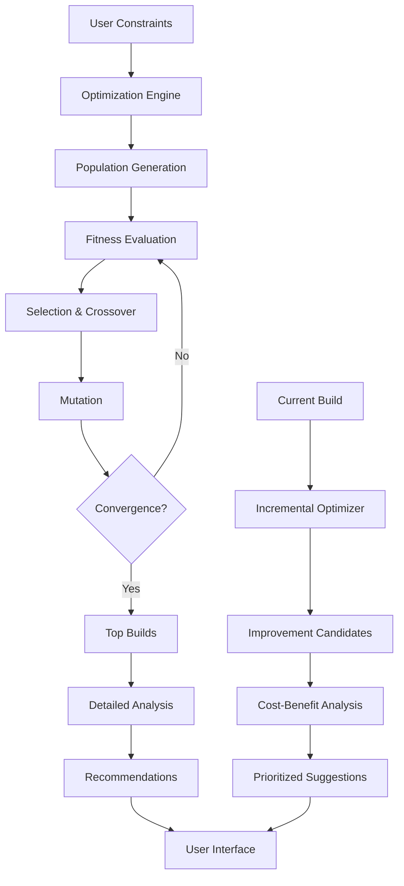

# Phase 3: Optimization Features - High Level Design Document

## 1. Executive Summary

Phase 3 transforms the toolkit into an intelligent optimization platform that helps players make data-driven decisions about their builds. This phase introduces genetic algorithms for build optimization, equipment upgrade analysis, multi-build comparison systems, and incremental improvement recommendations.

## 2. System Architecture

### 2.1 Optimization Architecture Overview
```
┌────────────────────────────────────────────────────────────────────────┐
│                       Optimization Engine Layer                         │
├────────────────────────────────────────────────────────────────────────┤
│                                                                          │
│  ┌──────────────────────┐  ┌──────────────────────────────────────┐  │
│  │  Genetic Algorithm   │  │    Constraint Satisfaction          │  │
│  │  Build Optimizer     │  │         Solver                      │  │
│  └──────────┬───────────┘  └─────────────┬────────────────────────┘  │
│             │                             │                             │
│  ┌──────────▼──────────────────────────────▼────────────────────────┐ │
│  │                  Multi-Objective Optimization Core                │ │
│  │  ┌──────────────┐  ┌──────────────────┐  ┌──────────────────┐  │ │
│  │  │ DPS Maximize │  │ Survivability    │  │  Cost/Efficiency │  │ │
│  │  │   Objective  │  │    Objective     │  │    Objective     │  │ │
│  │  └──────────────┘  └──────────────────┘  └──────────────────┘  │ │
│  └────────────────────────────────────────────────────────────────────┘ │
│                                                                          │
│  ┌────────────────────────────────────────────────────────────────────┐ │
│  │                      Comparison & Analysis Layer                   │ │
│  │  ┌──────────────────┐  ┌──────────────────┐  ┌────────────────┐ │ │
│  │  │ Build Comparator │  │ Equipment        │  │  Incremental   │ │ │
│  │  │                  │  │   Analyzer       │  │   Optimizer    │ │ │
│  │  └──────────────────┘  └──────────────────┘  └────────────────┘ │ │
│  └────────────────────────────────────────────────────────────────────┘ │
│                                                                          │
│  ┌────────────────────────────────────────────────────────────────────┐ │
│  │                     Recommendation Engine                          │ │
│  │  ┌──────────────────┐  ┌──────────────────┐  ┌────────────────┐ │ │
│  │  │ Next Best Node   │  │  Gear Upgrade    │  │  Build Path    │ │ │
│  │  │  Recommender     │  │   Suggester      │  │   Planner      │ │ │
│  │  └──────────────────┘  └──────────────────┘  └────────────────┘ │ │
│  └────────────────────────────────────────────────────────────────────┘ │
└────────────────────────────────────────────────────────────────────────┘
```

### 2.2 Data Flow Architecture


## 3. Core Optimization Systems

### 3.1 Genetic Algorithm Build Optimizer
```typescript
interface GeneticOptimizer {
  // Configuration
  populationSize: number
  generations: number
  mutationRate: number
  crossoverRate: number
  elitism: number

  // Core operations
  generateInitialPopulation(constraints: BuildConstraints): BuildGenome[]
  evaluateFitness(genome: BuildGenome, objectives: ObjectiveFunction[]): number
  selection(population: BuildGenome[]): BuildGenome[]
  crossover(parent1: BuildGenome, parent2: BuildGenome): BuildGenome[]
  mutation(genome: BuildGenome): BuildGenome

  // Optimization process
  optimize(constraints: BuildConstraints, objectives: Objective[]): OptimizationResult
}

interface BuildGenome {
  // Genetic representation
  passiveNodes: BitArray          // Allocated passive nodes
  equipment: EquipmentGenes[]     // Equipment choices
  skills: SkillGenes[]            // Skill setup
  jewels: JewelGenes[]           // Jewel selections

  // Metadata
  fitness?: number
  objectives?: ObjectiveScores
  generation?: number
  valid?: boolean
}
```

### 3.2 Multi-Objective Optimization Framework
```typescript
interface MultiObjectiveOptimizer {
  // Objective functions
  objectives: ObjectiveFunction[]

  // Pareto optimization
  findParetoFront(solutions: Solution[]): Solution[]
  dominates(solution1: Solution, solution2: Solution): boolean

  // Weighted optimization
  weightedSum(objectives: ObjectiveScore[], weights: number[]): number
  normalizeObjectives(scores: ObjectiveScore[]): ObjectiveScore[]

  // Constraint handling
  applyConstraints(solution: Solution, constraints: Constraint[]): Solution
  penalizeFitness(fitness: number, violations: Violation[]): number
}

interface ObjectiveFunction {
  name: string
  type: 'maximize' | 'minimize'
  weight: number
  evaluate(build: Character): number
  normalize(value: number): number
}
```

### 3.3 Constraint Satisfaction Engine
```typescript
interface ConstraintEngine {
  // Constraint types
  hardConstraints: HardConstraint[]    // Must satisfy
  softConstraints: SoftConstraint[]    // Prefer to satisfy

  // Validation
  validateHard(build: Character): ValidationResult
  evaluateSoft(build: Character): SoftScore

  // Constraint propagation
  propagateConstraints(partial: PartialBuild): ConstraintDomain
  pruneInvalidChoices(domain: ConstraintDomain): ConstraintDomain

  // Backtracking
  findValidSolution(constraints: Constraint[]): Solution | null
}

interface Constraint {
  type: 'hard' | 'soft'
  priority: number
  evaluate(build: Character): boolean | number
  description: string
}
```

## 4. Equipment Optimization System

### 4.1 Equipment Upgrade Analyzer
```typescript
interface EquipmentOptimizer {
  // Analysis
  analyzeCurrentGear(character: Character): GearAnalysis
  findUpgrades(slot: EquipmentSlot, budget?: number): UpgradeOption[]

  // Scoring
  scoreItem(item: Item, character: Character): ItemScore
  calculateUpgradeValue(current: Item, upgrade: Item): UpgradeValue

  // Market integration
  fetchMarketPrices(items: Item[]): MarketPrice[]
  calculateEfficiency(upgrade: UpgradeOption): EfficiencyScore

  // Recommendations
  recommendUpgradePath(character: Character, budget: number): UpgradePath
  prioritizeUpgrades(options: UpgradeOption[]): PrioritizedList
}

interface UpgradeOption {
  item: Item
  slot: EquipmentSlot
  improvement: {
    dps: number
    survivability: number
    utility: number
  }
  cost: {
    currency: CurrencyAmount
    availability: 'common' | 'rare' | 'unique'
  }
  efficiency: number
}
```

### 4.2 Affix Optimization
```typescript
interface AffixOptimizer {
  // Affix analysis
  analyzeAffixes(item: Item): AffixAnalysis
  findOptimalAffixes(slot: EquipmentSlot, build: Character): OptimalAffixes

  // Crafting optimization
  suggestCraftingPath(item: Item, target: AffixSet): CraftingPath
  calculateCraftingCost(path: CraftingPath): CurrencyAmount

  // Trade-offs
  evaluateAffixTradeoffs(options: AffixOption[]): TradeoffAnalysis
}
```

## 5. Build Comparison System

### 5.1 Comparison Framework
```typescript
interface BuildComparisonSystem {
  // Core comparison
  compare(builds: Character[]): ComparisonResult

  // Metrics
  calculateMetrics(build: Character): BuildMetrics
  normalizeMetrics(metrics: BuildMetrics[]): NormalizedMetrics[]

  // Analysis
  identifyStrengths(build: Character, baseline: Character): Strength[]
  identifyWeaknesses(build: Character, baseline: Character): Weakness[]

  // Visualization data
  generateRadarData(builds: Character[]): RadarChartData
  generateProgressionData(builds: Character[]): ProgressionData

  // Recommendations
  suggestImprovements(build: Character, reference: Character): Improvement[]
}

interface BuildMetrics {
  // Offensive
  totalDPS: number
  burstDPS: number
  sustainedDPS: number

  // Defensive
  effectiveHP: number
  maxHit: number
  recovery: number
  mitigation: number

  // Utility
  movementSpeed: number
  areaOfEffect: number
  range: number

  // Economic
  totalCost: number
  maintenanceCost: number
}
```

### 5.2 Similarity Analysis
```typescript
interface SimilarityAnalyzer {
  // Distance metrics
  calculateDistance(build1: Character, build2: Character): number
  findSimilarBuilds(target: Character, pool: Character[]): SimilarBuild[]

  // Clustering
  clusterBuilds(builds: Character[]): BuildCluster[]
  identifyArchetypes(clusters: BuildCluster[]): Archetype[]

  // Transition analysis
  findTransitionPath(from: Character, to: Character): TransitionPath
  calculateTransitionCost(path: TransitionPath): TransitionCost
}
```

## 6. Incremental Optimization

### 6.1 Incremental Improvement Engine
```typescript
interface IncrementalOptimizer {
  // Passive tree optimization
  findBestPassiveNode(character: Character, points: number): PassiveRecommendation
  evaluatePassivePaths(from: string, targets: string[]): PathEvaluation[]

  // Incremental analysis
  calculateMarginalValue(change: Change, character: Character): MarginalValue
  findHighestImpact(options: Change[], budget: Resource): Change

  // Path planning
  planImprovementPath(current: Character, goal: BuildGoal): ImprovementPlan
  optimizeSequence(improvements: Improvement[]): OptimalSequence
}

interface PassiveRecommendation {
  node: PassiveNode
  path: string[]
  cost: number
  improvement: {
    immediate: ImprovementMetrics
    cumulative: ImprovementMetrics
  }
  efficiency: number
  alternatives: PassiveNode[]
}
```

### 6.2 Resource Allocation Optimizer
```typescript
interface ResourceOptimizer {
  // Point allocation
  allocatePassivePoints(available: number, options: PassiveNode[]): Allocation
  optimizeGemLevels(gems: Gem[], experience: number): LevelAllocation

  // Currency optimization
  optimizeCurrencyUsage(currency: Currency, options: CraftingOption[]): CurrencyPlan

  // Time optimization
  prioritizeByTimeInvestment(improvements: Improvement[]): TimeEfficient[]
}
```

## 7. Recommendation Engine

### 7.1 Intelligent Recommendations
```typescript
interface RecommendationEngine {
  // Analysis
  analyzePlayerStyle(history: BuildHistory): PlayerStyle
  identifyGoals(character: Character, activity: Activity[]): BuildGoal[]

  // Recommendation generation
  generateRecommendations(character: Character, context: Context): Recommendation[]
  personalizeRecommendations(base: Recommendation[], style: PlayerStyle): Recommendation[]

  // Explanation
  explainRecommendation(recommendation: Recommendation): Explanation
  generateInsights(analysis: Analysis): Insight[]
}

interface Recommendation {
  type: 'passive' | 'equipment' | 'skill' | 'jewel'
  action: string
  impact: ImpactMetrics
  confidence: number
  reasoning: string[]
  alternatives: Alternative[]
}
```

### 7.2 Machine Learning Integration
```typescript
interface MLOptimizer {
  // Model management
  models: {
    buildSuccess: PredictionModel
    itemValuation: ValuationModel
    metaAnalysis: TrendModel
  }

  // Predictions
  predictBuildViability(build: Character): ViabilityScore
  predictItemValue(item: Item, market: MarketState): PriceEstimate
  predictMetaShift(changes: PatchNotes): MetaPrediction

  // Learning
  updateModels(feedback: UserFeedback): void
  retrainModels(data: TrainingData): void
}
```

## 8. Performance Optimization

### 8.1 Computational Optimization
```typescript
interface ComputationOptimizer {
  // Parallel processing
  parallelizeGeneticAlgorithm(population: BuildGenome[]): ParallelGA
  distributedFitnessEvaluation(genomes: BuildGenome[]): Promise<number[]>

  // Caching
  memoizeFitnessCalculation: MemoizedFunction
  cachePartialResults: PartialCache

  // Early termination
  detectConvergence(population: BuildGenome[]): boolean
  pruneSearchSpace(space: SearchSpace): SearchSpace
}
```

### 8.2 Search Space Reduction
```typescript
interface SearchSpaceReducer {
  // Heuristics
  applyDomainHeuristics(space: SearchSpace): SearchSpace
  identifyPromissingRegions(space: SearchSpace): Region[]

  // Pruning
  pruneInfeasible(options: Option[]): Option[]
  removeRedundant(builds: Character[]): Character[]

  // Sampling
  intelligentSampling(space: SearchSpace, samples: number): Sample[]
  adaptiveSampling(feedback: Feedback): SamplingStrategy
}
```

## 9. User Interface Design

### 9.1 Optimization Dashboard
```typescript
interface OptimizationDashboard {
  // Controls
  objectiveSelector: ObjectiveSelector
  constraintBuilder: ConstraintBuilder
  budgetSlider: BudgetControl

  // Visualization
  paretoFrontVisualizer: ParetoChart
  convergenceGraph: ConvergenceDisplay
  buildExplorer: InteractiveBuildExplorer

  // Results
  topBuildsDisplay: BuildGallery
  comparisonMatrix: ComparisonMatrix
  recommendationFeed: RecommendationFeed
}
```

### 9.2 Interactive Optimization
```typescript
interface InteractiveOptimizer {
  // Real-time feedback
  livePreview: LivePreview
  instantRecalculation: InstantCalc

  // User guidance
  optimizationWizard: GuidedOptimization
  tooltipSystem: ContextualHelp

  // Customization
  customObjectives: ObjectiveBuilder
  preferenceProfiles: PreferenceManager
}
```

## 10. Data Persistence & Caching

### 10.1 Optimization Cache
```typescript
interface OptimizationCache {
  // Result caching
  cacheOptimizationResult(params: OptimizationParams, result: Result): void
  getCachedResult(params: OptimizationParams): Result | null

  // Incremental caching
  cachePartialEvaluation(partial: PartialBuild, evaluation: Evaluation): void
  buildFromCache(constraints: Constraint[]): PartialBuild[]

  // Expiration
  invalidateOutdated(version: GameVersion): void
  refreshCache(updates: DataUpdate[]): void
}
```

### 10.2 Build Database
```typescript
interface BuildDatabase {
  // Storage
  saveBuild(build: Character, metadata: BuildMetadata): string
  loadBuild(id: string): Character

  // Indexing
  indexByArchetype(build: Character): void
  searchBuilds(query: BuildQuery): Character[]

  // Analytics
  trackBuildPerformance(id: string, metrics: PerformanceMetrics): void
  analyzeTrends(): TrendAnalysis
}
```

## 11. Integration Points

### 11.1 Phase 1-2 Integration
- Utilize existing calculation engine for fitness evaluation
- Leverage character data models
- Extend UI components for optimization displays
- Use established API patterns

### 11.2 Phase 4 Preparation
- Design with mobile responsiveness in mind
- Structure for community sharing features
- Prepare visualization data formats
- Build modular components for reuse

## 12. Performance Requirements

### 12.1 Optimization Performance
| Operation | Target Time | Max Time |
|-----------|------------|----------|
| Genetic Algorithm (100 generations) | < 5s | < 10s |
| Incremental Node Recommendation | < 200ms | < 500ms |
| Equipment Upgrade Analysis | < 500ms | < 1s |
| Build Comparison (5 builds) | < 300ms | < 600ms |
| Real-time Preview Update | < 50ms | < 100ms |

### 12.2 Scalability Metrics
- Support 1000+ items in equipment database
- Handle 100+ concurrent optimizations
- Store 10,000+ cached build evaluations
- Process 500+ passive nodes efficiently

## 13. Testing Strategy

### 13.1 Algorithm Testing
```typescript
interface AlgorithmTests {
  // Correctness
  optimalityTests: Test[]      // Known optimal solutions
  constraintTests: Test[]      // Constraint satisfaction
  convergenceTests: Test[]     // Algorithm convergence

  // Performance
  benchmarkTests: Test[]       // Performance benchmarks
  scalabilityTests: Test[]     // Large problem instances

  // Robustness
  edgeCaseTests: Test[]        // Extreme inputs
  stabilityTests: Test[]       // Solution stability
}
```

### 13.2 Integration Testing
- End-to-end optimization flows
- UI responsiveness under load
- Cache invalidation scenarios
- Cross-browser compatibility

## 14. Risk Mitigation

### 14.1 Technical Risks
- **Computation Complexity**: Mitigate with progressive calculation and caching
- **Solution Quality**: Ensure through extensive testing and validation
- **User Expectations**: Manage through clear progress indicators and explanations

### 14.2 Performance Risks
- **Memory Usage**: Implement memory limits and garbage collection
- **CPU Intensity**: Use Web Workers and chunked processing
- **Network Overhead**: Minimize through efficient caching strategies

## 15. Success Metrics

### 15.1 Optimization Quality
- Pareto front coverage > 80%
- Solution improvement > 20% average
- Constraint satisfaction rate > 95%
- User satisfaction score > 4.5/5

### 15.2 System Performance
- 95th percentile response time < 1s
- Optimization completion rate > 99%
- Cache hit ratio > 70%
- Zero critical errors in production