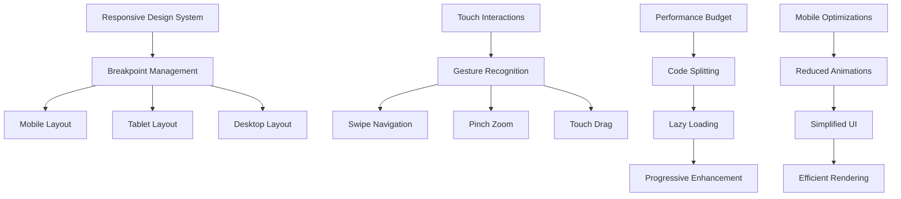

# Phase 4: Polish & Advanced Features - High Level Design Document

## 1. Executive Summary

Phase 4 represents the final transformation of the toolkit into a production-ready, professional application. This phase focuses on performance optimization, mobile-first responsive design, advanced data visualizations, community features, and comprehensive error handling to deliver a polished user experience.

## 2. System Architecture

### 2.1 Performance Architecture
```
┌────────────────────────────────────────────────────────────────────────┐
│                       Performance Optimization Layer                     │
├────────────────────────────────────────────────────────────────────────┤
│                                                                          │
│  ┌──────────────────────┐  ┌──────────────────────────────────────┐  │
│  │   Service Worker     │  │      Web Worker Pool                 │  │
│  │   (Offline Cache)    │  │   (Parallel Processing)              │  │
│  └──────────┬───────────┘  └─────────────┬────────────────────────┘  │
│             │                             │                             │
│  ┌──────────▼──────────────────────────────▼────────────────────────┐ │
│  │                    Advanced Caching Strategy                       │ │
│  │  ┌──────────────┐  ┌──────────────────┐  ┌──────────────────┐  │ │
│  │  │ Memory Cache │  │   IndexedDB      │  │   CDN Cache      │  │ │
│  │  │  (Hot Data)  │  │  (Persistent)    │  │  (Static Assets) │  │ │
│  │  └──────────────┘  └──────────────────┘  └──────────────────┘  │ │
│  └────────────────────────────────────────────────────────────────────┘ │
│                                                                          │
│  ┌────────────────────────────────────────────────────────────────────┐ │
│  │                     Progressive Web App Features                   │ │
│  │  ┌──────────────────┐  ┌──────────────────┐  ┌────────────────┐ │ │
│  │  │ Offline Support  │  │ Push Notifications│  │  App Install   │ │ │
│  │  │                  │  │                   │  │   Prompts      │ │ │
│  │  └──────────────────┘  └──────────────────┘  └────────────────┘ │ │
│  └────────────────────────────────────────────────────────────────────┘ │
└────────────────────────────────────────────────────────────────────────┘

┌────────────────────────────────────────────────────────────────────────┐
│                         Community & Social Layer                         │
├────────────────────────────────────────────────────────────────────────┤
│  ┌──────────────────────┐  ┌──────────────────────────────────────┐  │
│  │   Build Sharing      │  │      Community Database              │  │
│  │     System           │  │        Integration                   │  │
│  └──────────┬───────────┘  └─────────────┬────────────────────────┘  │
│             │                             │                             │
│  ┌──────────▼──────────────────────────────▼────────────────────────┐ │
│  │                    Import/Export Framework                         │ │
│  │  ┌──────────────┐  ┌──────────────────┐  ┌──────────────────┐  │ │
│  │  │ PoB Format   │  │  URL Encoding    │  │  JSON Export     │  │ │
│  │  │   Support    │  │    & Sharing     │  │   & Import       │  │ │
│  │  └──────────────┘  └──────────────────┘  └──────────────────┘  │ │
│  └────────────────────────────────────────────────────────────────────┘ │
└────────────────────────────────────────────────────────────────────────┘
```

### 2.2 Mobile Architecture


## 3. Performance Optimization System

### 3.1 Web Worker Architecture
```typescript
interface WorkerPoolSystem {
  // Pool management
  workers: Worker[]
  taskQueue: TaskQueue
  workerStatus: Map<Worker, WorkerState>

  // Task distribution
  distributeTask(task: ComputeTask): Promise<Result>
  loadBalance(tasks: ComputeTask[]): TaskAssignment[]

  // Worker lifecycle
  spawnWorker(): Worker
  terminateWorker(worker: Worker): void
  recycleWorker(worker: Worker): void

  // Performance monitoring
  measureWorkerPerformance(): WorkerMetrics
  optimizePoolSize(): void
}

interface ComputeTask {
  id: string
  type: TaskType
  payload: any
  priority: number
  timeout?: number
  dependencies?: string[]
}
```

### 3.2 Advanced Caching Strategy
```typescript
interface CachingSystem {
  // Multi-layer cache
  layers: {
    memory: MemoryCache
    indexedDB: PersistentCache
    serviceWorker: NetworkCache
    cdn: StaticCache
  }

  // Cache strategies
  strategies: {
    cacheFirst(): CacheStrategy
    networkFirst(): CacheStrategy
    staleWhileRevalidate(): CacheStrategy
    networkOnly(): CacheStrategy
  }

  // Intelligent caching
  predictivePreload(userBehavior: UserPattern): void
  adaptiveCaching(usage: UsageMetrics): void

  // Cache management
  invalidateStale(): void
  compressCache(): void
  optimizeStorage(): StorageOptimization
}
```

### 3.3 Bundle Optimization
```typescript
interface BundleOptimizer {
  // Code splitting
  routes: RouteSplitConfig[]
  components: ComponentSplitConfig[]
  vendors: VendorSplitConfig[]

  // Dynamic imports
  lazyLoad(component: string): Promise<Component>
  prefetch(routes: string[]): void

  // Bundle analysis
  analyzeBundle(): BundleReport
  identifyDuplicates(): Duplicate[]
  suggestOptimizations(): Optimization[]

  // Tree shaking
  eliminateDeadCode(): void
  optimizeImports(): void
}
```

## 4. Mobile Optimization

### 4.1 Responsive Design System
```typescript
interface ResponsiveSystem {
  // Breakpoints
  breakpoints: {
    mobile: 320
    phablet: 576
    tablet: 768
    desktop: 1024
    wide: 1440
  }

  // Layout system
  layouts: {
    mobile: MobileLayout
    tablet: TabletLayout
    desktop: DesktopLayout
  }

  // Adaptive components
  adaptiveComponents: Map<Component, ResponsiveVariant[]>

  // Performance
  viewportOptimization: ViewportConfig
  touchOptimization: TouchConfig
}
```

### 4.2 Mobile-Specific Features
```typescript
interface MobileFeatures {
  // Touch interactions
  gestures: {
    swipe: SwipeHandler
    pinch: PinchHandler
    longPress: LongPressHandler
    doubleTap: DoubleTapHandler
  }

  // Mobile UI
  bottomSheet: BottomSheetComponent
  pullToRefresh: PullRefreshComponent
  floatingActionButton: FABComponent

  // Device features
  vibration: VibrationAPI
  orientation: OrientationHandler
  deviceMotion: MotionHandler

  // Performance
  reducedMotion: MotionPreference
  dataSaver: DataSaverMode
}
```

### 4.3 Progressive Web App
```typescript
interface PWAFeatures {
  // Service Worker
  serviceWorker: {
    registration: ServiceWorkerRegistration
    updateStrategy: UpdateStrategy
    cacheStrategy: CacheStrategy
  }

  // App manifest
  manifest: {
    name: string
    icons: Icon[]
    display: 'standalone' | 'fullscreen'
    themeColor: string
  }

  // Capabilities
  offlineSupport: OfflineCapability
  backgroundSync: BackgroundSyncManager
  pushNotifications: PushManager

  // Installation
  installPrompt: InstallPromptHandler
  appBadging: BadgingAPI
}
```

## 5. Advanced Visualizations

### 5.1 Interactive Charts System
```typescript
interface VisualizationSystem {
  // Chart types
  charts: {
    radar: RadarChart           // Build comparison
    sankey: SankeyDiagram       // Damage flow
    tree: TreeVisualization     // Passive tree
    heatmap: HeatMap           // Efficiency matrix
    parallel: ParallelCoordinates // Multi-dimensional data
  }

  // Interactivity
  interactions: {
    zoom: ZoomControls
    pan: PanControls
    brush: BrushSelection
    tooltip: TooltipSystem
    crosshair: CrosshairGuide
  }

  // Animation
  animations: {
    transitions: TransitionConfig
    morphing: MorphAnimation
    staging: StagedAnimation
  }
}
```

### 5.2 Data Visualization Components
```typescript
interface DataVisualization {
  // Damage breakdown
  damageFlow: {
    render(): SankeyDiagram
    showBreakdown(layer: string): DetailView
    animateFlow(): Animation
  }

  // Build comparison
  comparisonRadar: {
    renderAxes(metrics: Metric[]): Axes
    plotBuilds(builds: Build[]): DataPoints
    highlightDifferences(): Emphasis
  }

  // Progression timeline
  progressionChart: {
    showMilestones(character: Character): Timeline
    animateGrowth(history: History): Animation
    projectFuture(plan: Plan): Projection
  }

  // Heat maps
  efficiencyHeatmap: {
    renderGrid(data: EfficiencyData): Grid
    colorScale(efficiency: number): Color
    showDetails(cell: Cell): Popup
  }
}
```

### 5.3 3D Visualizations
```typescript
interface ThreeDVisualization {
  // Passive tree 3D
  passiveTree3D: {
    renderer: WebGLRenderer
    camera: PerspectiveCamera
    controls: OrbitControls
    renderTree(nodes: Node[]): Scene
  }

  // Character model
  characterModel: {
    loadModel(character: Character): Model3D
    applyEquipment(items: Item[]): void
    animateSkills(skills: Skill[]): Animation
  }

  // Performance
  levelOfDetail: LODSystem
  frustumCulling: CullingSystem
}
```

## 6. Community Features

### 6.1 Build Sharing System
```typescript
interface BuildSharingSystem {
  // Export formats
  exportFormats: {
    pob: PathOfBuildingExporter
    json: JSONExporter
    url: URLEncoder
    image: BuildImageGenerator
  }

  // Import capabilities
  importParsers: {
    pob: PathOfBuildingParser
    json: JSONParser
    url: URLDecoder
    paste: PasteImporter
  }

  // Sharing features
  sharing: {
    generateShareLink(build: Build): string
    createBuildCode(build: Build): string
    generateQRCode(link: string): QRCode
    socialShare(platform: string, build: Build): void
  }

  // Versioning
  versioning: {
    saveBuildVersion(build: Build): Version
    compareVersions(v1: Version, v2: Version): Diff
    rollback(build: Build, version: Version): Build
  }
}
```

### 6.2 Community Integration
```typescript
interface CommunityFeatures {
  // Build database
  buildRepository: {
    publish(build: Build, metadata: Metadata): BuildId
    search(query: SearchQuery): Build[]
    rate(buildId: string, rating: Rating): void
    comment(buildId: string, comment: Comment): void
  }

  // Social features
  social: {
    follow(userId: string): void
    share(content: Content): void
    like(contentId: string): void
  }

  // Leaderboards
  leaderboards: {
    topBuilds(category: string): Build[]
    trending(timeframe: string): Build[]
    mostEfficient(constraint: Constraint): Build[]
  }

  // Forums integration
  forums: {
    createThread(build: Build): ForumThread
    linkDiscussion(buildId: string, threadUrl: string): void
  }
}
```

### 6.3 Collaboration Features
```typescript
interface CollaborationSystem {
  // Real-time collaboration
  realtime: {
    shareSession(build: Build): SessionId
    joinSession(sessionId: string): Connection
    syncChanges(changes: Change[]): void
  }

  // Build teams
  teams: {
    createTeam(name: string): Team
    inviteMembers(emails: string[]): Invitation[]
    shareWithTeam(build: Build, team: Team): void
  }

  // Comments & annotations
  annotations: {
    addNote(element: Element, note: string): Annotation
    highlightSection(section: Section): Highlight
    discussThread(topic: string): Discussion
  }
}
```

## 7. Error Handling & Monitoring

### 7.1 Comprehensive Error System
```typescript
interface ErrorHandlingSystem {
  // Error boundaries
  boundaries: {
    app: AppErrorBoundary
    route: RouteErrorBoundary
    component: ComponentErrorBoundary
  }

  // Error recovery
  recovery: {
    automatic: AutoRecovery
    manual: ManualRecovery
    fallback: FallbackStrategy
  }

  // Error tracking
  tracking: {
    capture(error: Error): ErrorReport
    group(errors: Error[]): ErrorGroup
    analyze(reports: ErrorReport[]): Analysis
  }

  // User feedback
  feedback: {
    showError(error: Error): UserNotification
    collectFeedback(): FeedbackForm
    suggestSolution(error: Error): Solution[]
  }
}
```

### 7.2 Monitoring & Analytics
```typescript
interface MonitoringSystem {
  // Performance monitoring
  performance: {
    webVitals: WebVitalsMonitor
    customMetrics: CustomMetricsCollector
    userTiming: UserTimingAPI
  }

  // Error monitoring
  errors: {
    sentry: SentryIntegration
    customLogger: ErrorLogger
    alerting: AlertSystem
  }

  // Analytics
  analytics: {
    pageViews: PageTracker
    events: EventTracker
    userFlow: FlowAnalyzer
    conversion: ConversionTracker
  }

  // Real User Monitoring
  rum: {
    sessionRecording: SessionRecorder
    heatmaps: HeatmapGenerator
    userJourney: JourneyTracker
  }
}
```

### 7.3 Debugging Tools
```typescript
interface DebuggingTools {
  // Development tools
  devTools: {
    inspector: BuildInspector
    profiler: PerformanceProfiler
    logger: DebugLogger
  }

  // Debug mode
  debugMode: {
    verboseLogging: boolean
    performanceOverlay: boolean
    networkInspector: boolean
    stateInspector: boolean
  }

  // Testing utilities
  testingUtils: {
    mockData: MockDataGenerator
    scenarios: TestScenarioRunner
    stressTest: StressTestSuite
  }
}
```

## 8. Accessibility Features

### 8.1 Accessibility System
```typescript
interface AccessibilitySystem {
  // Screen reader support
  screenReader: {
    ariaLabels: AriaLabelManager
    liveRegions: LiveRegionManager
    navigation: ScreenReaderNav
  }

  // Keyboard navigation
  keyboard: {
    shortcuts: KeyboardShortcuts
    tabOrder: TabOrderManager
    focusManagement: FocusManager
  }

  // Visual accessibility
  visual: {
    contrastMode: HighContrastMode
    fontSize: FontSizeControl
    colorBlind: ColorBlindMode
    reducedMotion: ReducedMotionMode
  }

  // Assistive features
  assistive: {
    voiceControl: VoiceCommands
    magnifier: ScreenMagnifier
    readAloud: TextToSpeech
  }
}
```

## 9. Internationalization

### 9.1 i18n System
```typescript
interface InternationalizationSystem {
  // Localization
  locales: Map<string, Locale>
  translations: TranslationManager
  dateTimeFormat: DateTimeFormatter
  numberFormat: NumberFormatter

  // Language detection
  detection: {
    browserLanguage(): string
    userPreference(): string
    geoLocation(): string
  }

  // Content management
  content: {
    loadTranslations(locale: string): Translations
    fallback(key: string): string
    pluralization(key: string, count: number): string
  }

  // RTL support
  rtl: {
    detection(): boolean
    layoutFlip(): void
    textDirection(): Direction
  }
}
```

## 10. Security Enhancements

### 10.1 Security Features
```typescript
interface SecuritySystem {
  // Content Security Policy
  csp: {
    policy: ContentSecurityPolicy
    reporting: CSPReporting
    nonce: NonceGenerator
  }

  // Input validation
  validation: {
    sanitizeHTML(input: string): string
    validateJSON(data: string): boolean
    escapeSQL(query: string): string
  }

  // Rate limiting
  rateLimiting: {
    api: APIRateLimiter
    auth: AuthRateLimiter
    search: SearchRateLimiter
  }

  // Encryption
  encryption: {
    encryptStorage(data: any): EncryptedData
    decryptStorage(encrypted: EncryptedData): any
    hashSensitive(data: string): string
  }
}
```

## 11. Deployment & DevOps

### 11.1 CI/CD Pipeline
```typescript
interface DeploymentPipeline {
  // Build stages
  stages: {
    lint: LintStage
    test: TestStage
    build: BuildStage
    deploy: DeployStage
  }

  // Environments
  environments: {
    development: DevEnvironment
    staging: StagingEnvironment
    production: ProductionEnvironment
  }

  // Deployment strategies
  strategies: {
    blueGreen: BlueGreenDeployment
    canary: CanaryDeployment
    rolling: RollingDeployment
  }

  // Monitoring
  monitoring: {
    healthChecks: HealthCheckSystem
    rollback: RollbackStrategy
    alerts: AlertingSystem
  }
}
```

### 11.2 Infrastructure
```typescript
interface Infrastructure {
  // CDN configuration
  cdn: {
    provider: 'cloudflare' | 'fastly' | 'akamai'
    caching: CachingRules
    purging: PurgeStrategy
  }

  // Edge functions
  edge: {
    workers: EdgeWorker[]
    routing: EdgeRouting
    middleware: EdgeMiddleware
  }

  // Database
  database: {
    primary: DatabaseConfig
    replicas: ReplicaConfig[]
    backup: BackupStrategy
  }

  // Monitoring
  observability: {
    logging: LoggingSystem
    metrics: MetricsSystem
    tracing: TracingSystem
  }
}
```

## 12. Performance Targets

### 12.1 Core Web Vitals
| Metric | Target | Critical |
|--------|--------|----------|
| LCP (Largest Contentful Paint) | < 1.5s | < 2.5s |
| FID (First Input Delay) | < 50ms | < 100ms |
| CLS (Cumulative Layout Shift) | < 0.05 | < 0.1 |
| FCP (First Contentful Paint) | < 1s | < 1.8s |
| TTI (Time to Interactive) | < 2.5s | < 3.8s |

### 12.2 Application Metrics
| Metric | Target |
|--------|--------|
| Bundle Size (gzipped) | < 300KB |
| Code Coverage | > 90% |
| Lighthouse Score | > 95 |
| Accessibility Score | 100 |
| PWA Score | 100 |

## 13. Testing Strategy

### 13.1 Comprehensive Testing
```typescript
interface TestingSuite {
  // Unit tests
  unit: {
    components: ComponentTests
    utilities: UtilityTests
    calculations: CalculationTests
  }

  // Integration tests
  integration: {
    api: APITests
    database: DatabaseTests
    workers: WorkerTests
  }

  // E2E tests
  e2e: {
    userFlows: FlowTests
    crossBrowser: BrowserTests
    mobile: MobileTests
  }

  // Performance tests
  performance: {
    load: LoadTests
    stress: StressTests
    endurance: EnduranceTests
  }

  // Visual tests
  visual: {
    regression: VisualRegression
    responsive: ResponsiveTests
    accessibility: A11yTests
  }
}
```

## 14. Documentation

### 14.1 Documentation System
```typescript
interface DocumentationSystem {
  // API documentation
  api: {
    swagger: SwaggerDocs
    postman: PostmanCollection
    examples: CodeExamples
  }

  // User documentation
  user: {
    guides: UserGuides
    tutorials: VideoTutorials
    faq: FrequentQuestions
  }

  // Developer documentation
  developer: {
    architecture: ArchitectureDocs
    contributing: ContributingGuide
    changelog: ChangeLog
  }

  // Interactive docs
  interactive: {
    playground: CodePlayground
    examples: InteractiveExamples
    sandbox: BuildSandbox
  }
}
```

## 15. Success Criteria

### 15.1 User Experience
- Page load time < 1.5s on 3G
- Smooth 60fps animations
- Zero layout shifts
- Instant interaction feedback
- Offline functionality

### 15.2 Quality Metrics
- 100% accessibility compliance
- Zero critical bugs
- < 0.1% error rate
- > 99.9% uptime
- > 4.8/5 user satisfaction